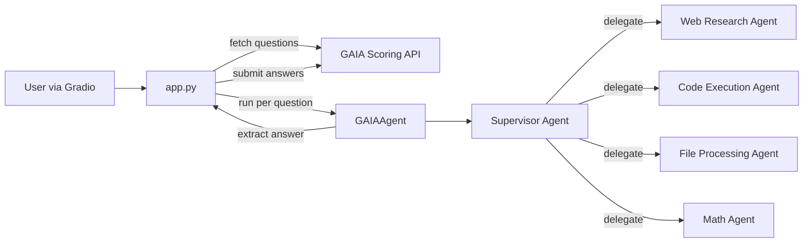
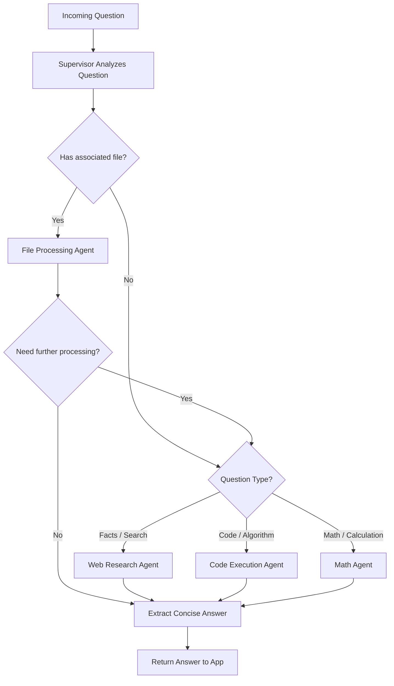
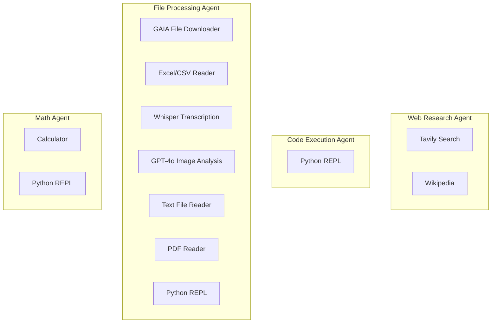
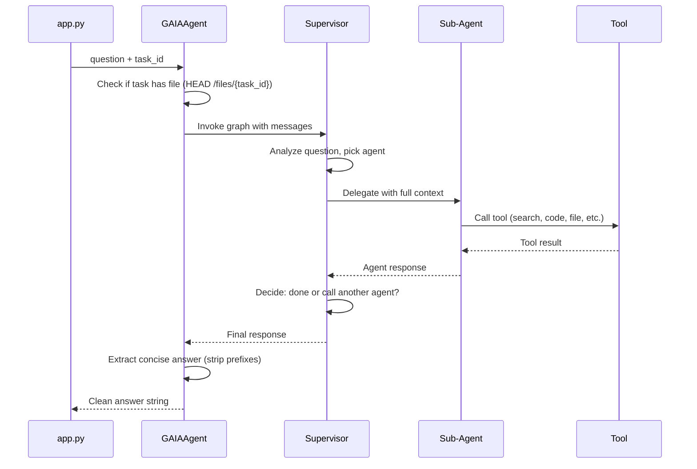
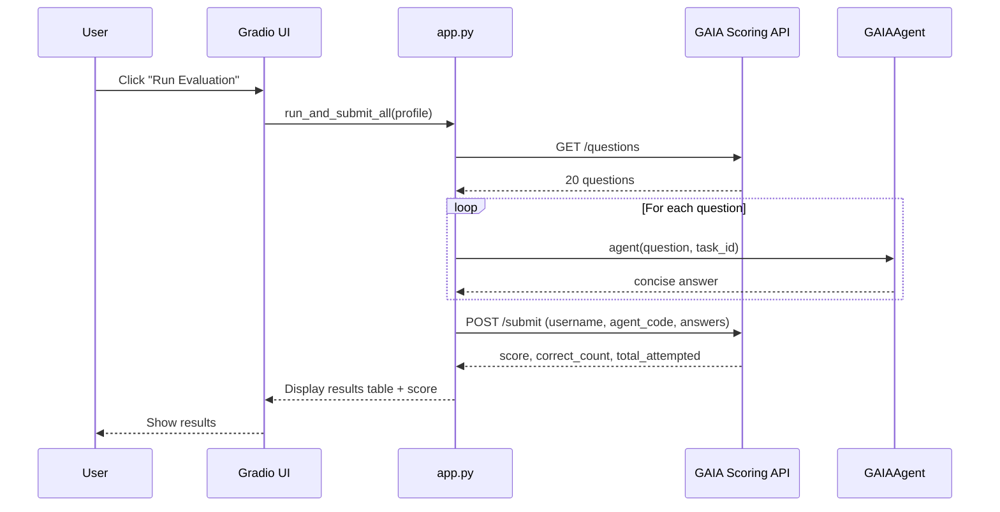
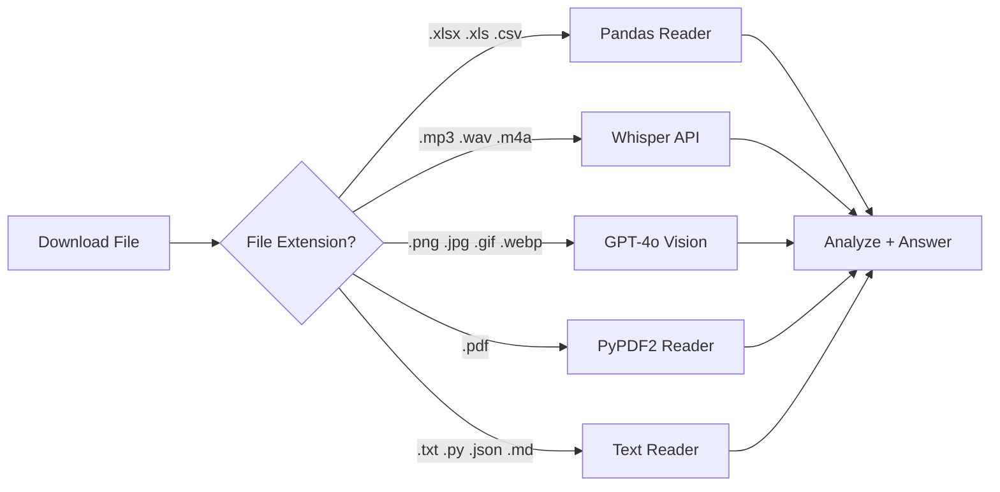

# Architecture

## System Overview

## Supervisor Routing

The supervisor receives each question, classifies it, and routes to the appropriate specialist. It can call multiple agents sequentially for multi-step questions.

## Agent-Tool Mapping

Each sub-agent is built with `create_react_agent` and has access to specific tools.

## Data Flow — Single Question

## Submission Flow — Full Evaluation

## File Processing Pipeline

The file agent handles multiple modalities depending on the file extension:

