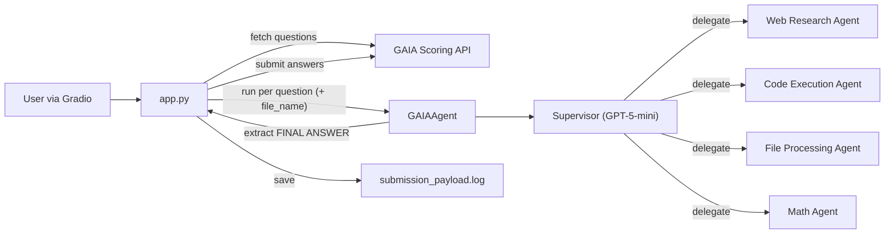
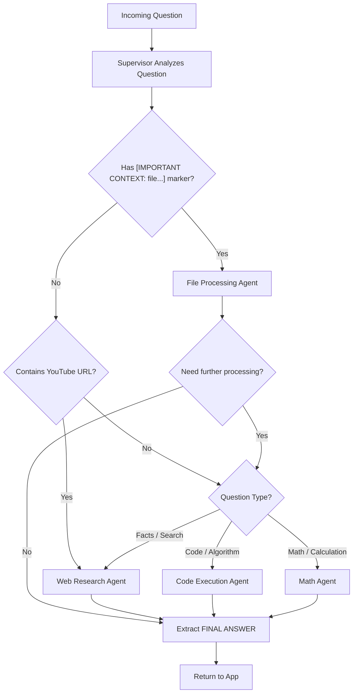
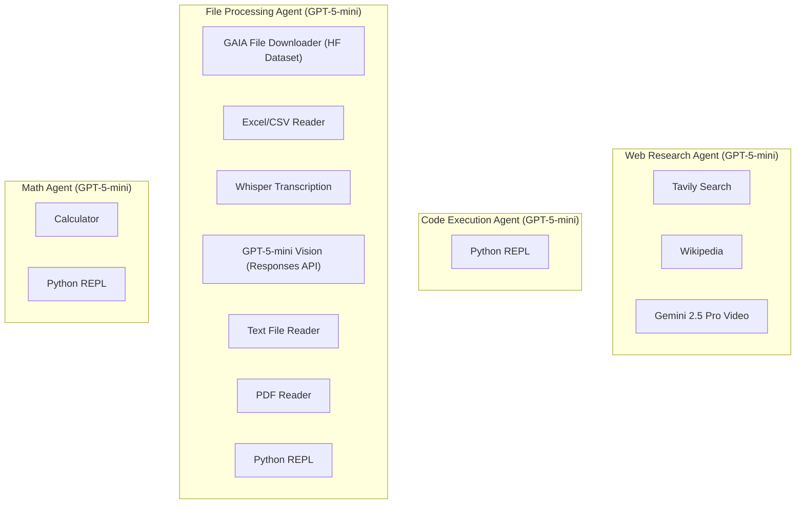
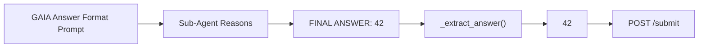
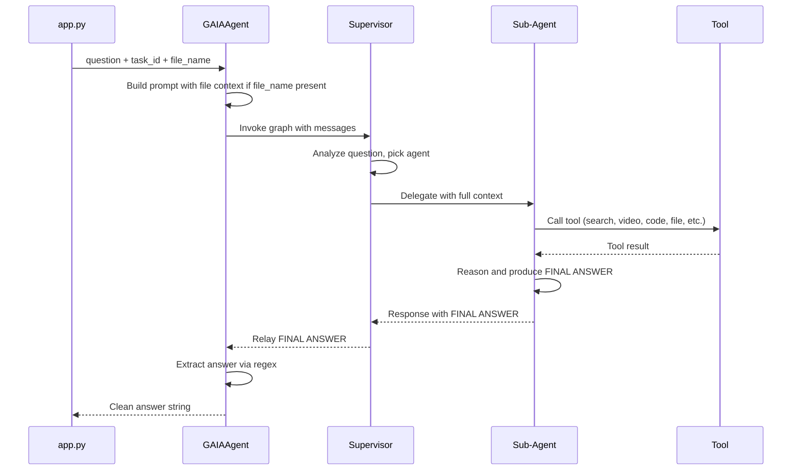
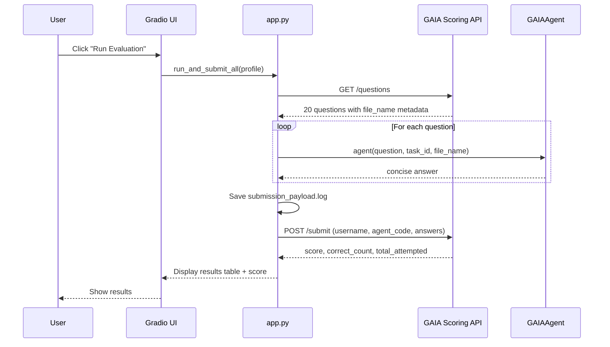
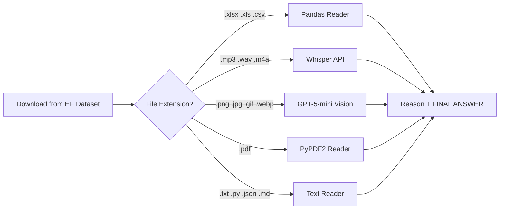
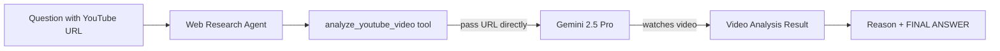

# Architecture

## System Overview

## Supervisor Routing

The supervisor receives each question and routes based on strict rules. The `[IMPORTANT CONTEXT: ...]` marker in the prompt is the only signal for file-based routing.

## Agent-Tool Mapping

Each sub-agent is built with `create_agent` and has access to specific tools.

## Answer Flow

All agents use the GAIA answer format prompt: reason through the problem, then output `FINAL ANSWER: [answer]`. The extraction layer strips the prefix before submission.

## Data Flow — Single Question

## Submission Flow — Full Evaluation

## File Processing Pipeline

The file agent downloads from the HuggingFace GAIA dataset (with API fallback) and handles multiple modalities by extension:

## Video Analysis Pipeline

YouTube video questions are handled by the web research agent using Gemini's native video understanding -- no download required:

